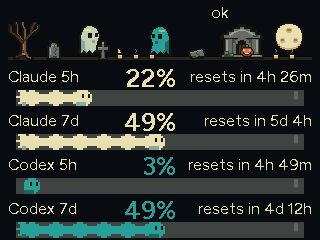
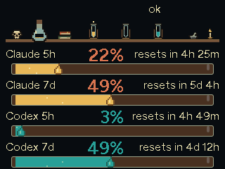
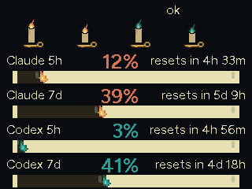
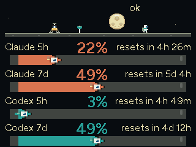
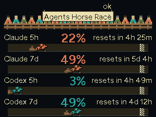
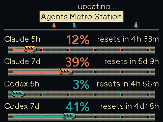
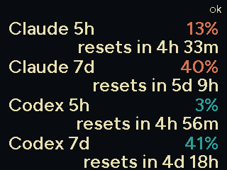

# TokenTide

<p align="center">
  
</p>

A standalone Claude Code usage monitor for the desk: the tide is your
token budget. No host software, no companion daemon - the device
connects to your WiFi and polls Anthropic directly with a dedicated
long-lived token, showing your usage on whatever screen it has.

Built as an ESPHome package with per-board implementations over a shared
engine: adopt it from the ESPHome Builder (inside or outside Home
Assistant) with a dozen lines of YAML, update over-the-air by bumping a
release tag, and pick the board entry that matches your hardware.

### M5Stack CoreS3

|  |  |
| :---: | :---: |
|  |  |
| The crab sails a sea that IS your usage | Main screen: readable from across the room |

<details>
<summary>Photos of the real device (yes, it actually looks like this)</summary>

|  |  |
| :---: | :---: |
|  |  |

</details>

### M5StickC Plus

|  |  |
| :---: | :---: |
|  |  |
| Same sea, pocket size | Minimal number-first UI |

<details>
<summary>Photos of the real device</summary>

|  |  |
| :---: | :---: |
|  |  |
| Bare | With the Joystick Hat |

</details>

## What it shows

- **5-hour window utilization** as a hero number readable from desk distance
- 5h and 7-day bars with reset countdowns
- Status line: limit status, battery, and the polling cost (requests/day)
  so you always know what the monitor itself consumes
- On-screen touch button to force a refresh
- Optional second provider: Codex (ChatGPT) usage next to Claude
- Switchable themes: long-press the screen (touch boards) or hold the
  front button (Stick) to cycle, or pick one from the Theme select in
  Home Assistant

## Supported devices

One codebase, per-board implementations: every board gets its own entry
under `boards/` combining the shared usage engine with hardware support
and a UI sized to what the device can do. All boards update the same way
(bump the release tag, flash OTA).

| Board | Import file | Status | UI |
|---|---|---|---|
| [M5Stack CoreS3](https://docs.m5stack.com/en/core/CoreS3) / [Stack-chan](https://docs.m5stack.com/en/StackChan/) | `boards/m5stack-cores3.yaml` | supported | rich 320x240 touch: hero number, bars, countdowns, touch refresh |
| M5Stack CoreS3 SE | `boards/m5stack-cores3.yaml` | untested, should work | same as CoreS3 (no battery gauge) |
| [M5StickC Plus](https://docs.m5stack.com/en/core/m5stickc_plus) | `boards/m5stickc-plus.yaml` | supported, tested on hardware | minimal 240x135: hero number, 7d bar, countdown; front button = refresh |
| M5StickC Plus + [Joystick Hat](https://docs.m5stack.com/en/hat/hat-joystick) | `boards/m5stickc-plus-joy.yaml` | supported | minimal + joystick: press = refresh, Y-axis = brightness |
| M5StickC Plus2 | planned | - | minimal (same UI class) |

Want another board? See [CONTRIBUTING.md](CONTRIBUTING.md) - the layout
is designed for drive-in board additions.

## How it gets the data

Anthropic exposes the unified rate-limit state as response headers on API
calls. TokenTide sends a minimal ~1-token probe request to `/v1/messages`
with your Claude Code OAuth token and reads
`anthropic-ratelimit-unified-{5h,7d}-{utilization,reset}` from the response.
At the default 120s interval that is ~720 tiny requests/day; the footer
shows the figure for your configured interval.

The token comes from `claude setup-token` (valid one year, scoped to
inference). Treat it like a password: it lives in your ESPHome secrets and
never leaves the device except toward api.anthropic.com over TLS.

## Codex (ChatGPT) - optional second provider

The device can also track a ChatGPT plan's rate-limit windows (same 5h/7d
shape) by polling `chatgpt.com/backend-api/wham/usage` with an OAuth
access token it refreshes on its own. Opt in by adding the provider
package and two secrets; without them nothing changes.

ChatGPT refresh tokens rotate on every use and the old one dies, so the
device must own its token chain. Seed it from a login nothing else uses:

```
CODEX_HOME=~/.codex-tokentide codex login
```

then copy `tokens.refresh_token` and `tokens.account_id` from
`~/.codex-tokentide/auth.json` into your secrets as `openai_refresh_token`
and `openai_account_id`, and do not log in with that CODEX_HOME again.
The device persists each rotated token, so the chain survives reboots;
reusing the seed elsewhere kills it and the status shows a token error
until you re-seed.

Builder users: add `packages/provider-openai.yaml` to the `files:` list
and the two substitutions next to `claude_token`. CLI users add to the
device YAML:

```yaml
substitutions:
  openai_refresh_token: !secret openai_refresh_token
  openai_account_id: !secret openai_account_id

packages:
  openai: !include packages/provider-openai.yaml
```

This adds Codex 5h/7d utilization sensors and a limit status to Home
Assistant, and the theme pages show the second provider automatically.

## Themes

The usage screen comes in multiple looks: the classic layout plus theme
pages (Graveyard, Alchemy, Candle, Moon, Horses, Metro, and the
image-free Text). Cycle them with a long press on the screen (touch
boards) or by holding the front button (Stick), or set the Theme select
from Home Assistant; the choice is persisted across reboots. A short tap
or button press only wakes a dimmed or sleeping screen. The themes are
the screensaver: there is no separate saver page by default.

Every theme renders the same four windows (Claude and Codex, 5h and 7d)
as a pixel-art scene, captured here from a live CoreS3:

|  |  |
| :---: | :---: |
|  |  |
| Graveyard: wavy ghosts stretch with usage, candles light per 20% | Alchemy: glass conduits fill with bubbling brew |
|  |  |
| Candle: wax strips burn down, flames ride the front | Moon: rockets fly the bars, astronauts feud over the flag |
|  |  |
| Agents Horse Race: four lanes, cheering crowd | Agents Metro Station: trains on rails, commuters waiting |
|  |  |
| Text: the numbers, big | |

The sailing-crab screensaver from v0.0.x still ships as an optional
package. To bring it back, add `packages/saver.yaml` to your `packages:`
list and set the `theme_tap_script` substitution to `"toggle_saver"` so a
tap opens and closes it (small screens also override the
`saver_sprite_*` substitutions, see the package header).

## Quick start - ESPHome Builder (Home Assistant or standalone)

1. Generate a token on any machine with Claude Code:

   ```
   claude setup-token
   ```

2. In the Builder's **Secrets** editor add one entry (your WiFi secrets
   are usually already there from the wizard):

   ```yaml
   claude_token: "sk-ant-oat01-..."
   ```

3. Create the device with the **New Device** wizard as usual (pick your
   board or any ESP32-S3 entry - our package overrides what matters).
   The wizard generates a YAML with `esphome:`, `api:`, `ota:`, `wifi:`
   and `captive_portal:` blocks. **Keep all of them**, and paste this at
   the bottom of the file:

   ```yaml
   substitutions:
     claude_token: !secret claude_token
     # poll_interval: "120"   # optional override, seconds

   packages:
     tokentide:
       url: https://github.com/eldios/tokentide
       ref: stable                            # latest release, auto-updating
       files: [boards/m5stack-cores3.yaml]   # pick your board from the table
       refresh: 1d
   ```

   To use a translated UI, add the language pack to the same list:
   `files: [boards/m5stack-cores3.yaml, lang/it.yaml]`.

4. First install: connect the device over USB and use "Install via USB"
   (or [web.esphome.io](https://web.esphome.io) from any browser).
5. Updates: with `ref: stable` just hit Install - the `stable` branch
   always points at the latest release, and `refresh:` controls how often
   the Builder re-fetches it. Prefer full control? Pin `ref: v0.0.3` and
   bump it yourself per release; `ref: main` rides the bleeding edge.

## Quick start - CLI

```
git clone https://github.com/eldios/tokentide
cd tokentide
cp secrets.example.yaml secrets.yaml   # fill wifi + claude_token
esphome run tokentide.yaml             # first time over USB, then OTA
```

Nix users: `nix develop` provides `esphome` and `esptool`.

## Languages

UI strings default to English. Ready-made packs live in `lang/`
(`it`, `de`, `fr`, `es`): add one to the `files:` list after the board
entry (see Quick start), or override individual `str_*` substitutions
directly in your config (top-level substitutions always win).

## Troubleshooting

**Build fails with an error that was already fixed** (even after "Clean
Build Files"): the Builder caches the git package for the `refresh:`
interval, and cleaning build files does not clear that cache. Set
`refresh: 0s` in the `packages:` block, hit Install once to force a
re-fetch, then restore `refresh: 1d`.

**Compiler warnings from `mipi_spi.cpp` (`-Wempty-body`)**: these come
from ESPHome's own display component, not from tokentide - harmless,
safe to ignore.

**Device reboots every ~15 minutes** (screen suddenly back to "waiting
for data"): ESPHome's native API reboots the device when no Home
Assistant client stays connected for `reboot_timeout` (default 15min).
tokentide disables that failsafe since v0.0.5; on older versions add
`reboot_timeout: 0s` under the `api:` block of your device YAML. If you
DO use Home Assistant and see this, HA is not holding its connection to
the device - re-add the ESPHome integration (see below).

## Home Assistant integration

The device exposes its sensors natively (5h/7d utilization per provider,
limit status, Anthropic status-page indicator, battery) plus a full set
of config entities: theme select, display (dim timeout/brightness,
screen-off timeout), session chime (enable, melody, volume, test button),
on boards with one the LED (mode select + light entity), and the optional
screensaver package's settings when it is included.
Automations like "notify me at 80% usage" are a two-line HA automation
away - no extra firmware work.

**If the device does not appear automatically**: mDNS discovery does not
cross VLANs, so on segmented networks (device on an IoT VLAN, HA
elsewhere) you must add it manually - Settings > Devices & services >
Add integration > ESPHome > host `tokentide.local` (or its IP), port
6053. OTA and logs from the ESPHome Builder work either way, since they
use direct routing rather than discovery.

## Screenshot tool (optional)

For UI development only - not part of the published package. Opt in by
adding both blocks to your device YAML:

```yaml
external_components:
  - source: github://eldios/tokentide@main
    components: [tokentide_screenshot]

tokentide_screenshot:
```

Then `tools/screenshot.sh <device-ip> out.png` grabs the live LVGL
screen (HTTP on port 8081, LAN-only, unauthenticated - leave it out of
day-to-day configs).

## Roadmap

- Stack-chan body features: servo gestures, LEDs, and friends

## Acknowledgements

This project stands on the shoulders of two lovely projects - thank you:

- [claude-usage-stick](https://github.com/oauramos/claude-usage-stick) by
  @oauramos - pioneered the standalone approach and the rate-limit-header
  probe this project uses.
- [Clawdmeter](https://github.com/HermannBjorgvin/Clawdmeter) by
  @HermannBjorgvin - the desk-distance UX this project chases, and the
  proof that a Claude usage meter belongs on every desk.

Hardware support comes from
[M5Stack's official ESPHome components](https://github.com/m5stack/esphome-yaml).

## License

MIT - see [LICENSE](LICENSE).
